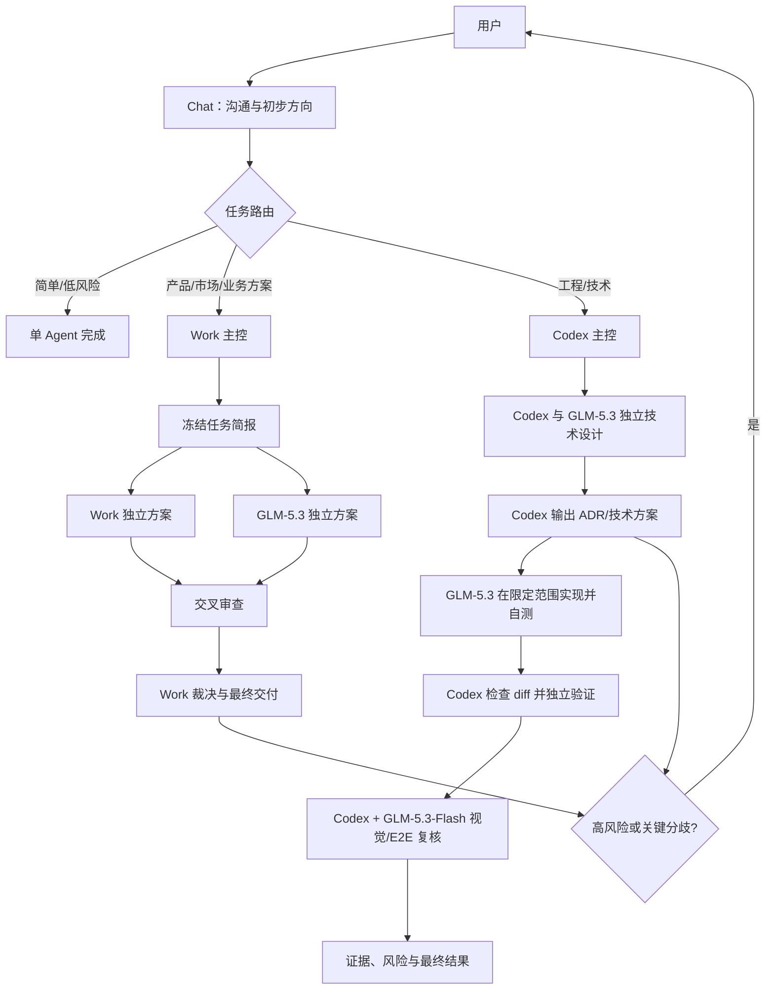
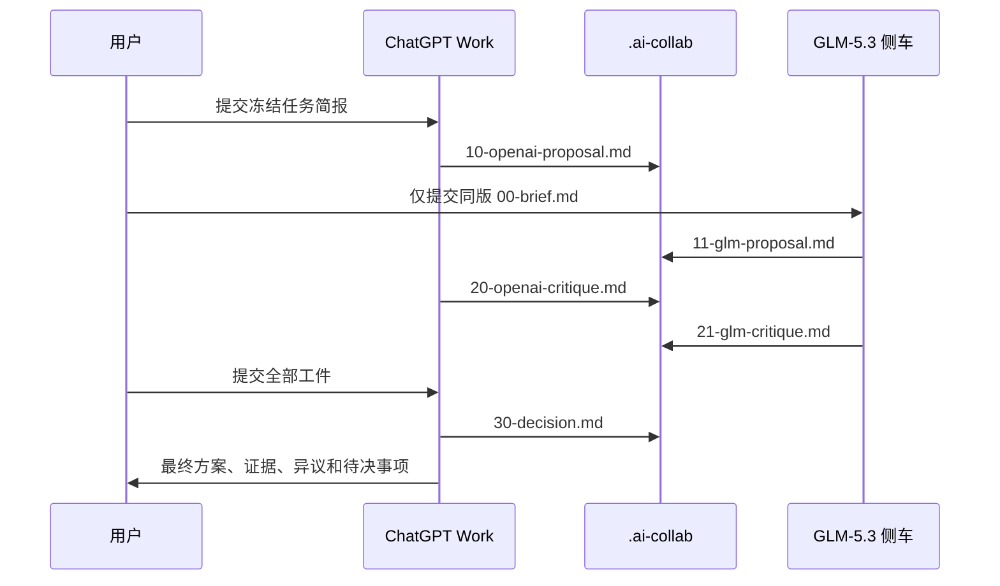

# MacBook 双 Agent 协作实施指南

> 适用组合：ChatGPT Chat / ChatGPT Work / Codex + GLM-5.3 / GLM-5.3-Flash  
> 版本：1.0  
> 官方能力核对日期：2026-08-28

## 1. 先给结论

推荐不要一开始建设复杂的“多 Agent 平台”，而是按下面四级逐步升级：

| 级别 | 使用场景 | 实现方式 | 当前建议 |
|---|---|---|---|
| L0：单 Agent | 简单聊天、解释、小任务 | Chat、Work、Codex 或 GLM 单独完成 | 立即使用 |
| L1：双 Agent 审议 | 产品方案、市场判断、技术设计 | 同一任务简报、独立输出、交叉审查、主 Agent 裁决 | 立即使用 |
| L2：主控—执行 | 工程开发、代码测试、UI 验收 | Codex 派单，GLM 在限定范围实现，Codex 集成验收 | 稳定运行 L1 后启用 |
| L3：编排工作流 | 多模块、长周期、重复流程 | MCP/CLI 桥接、状态机或 DAG、审批门、失败重试 | 流程重复稳定后再做 |

你的默认工作模式建议固定为：

1. Chat 负责轻量沟通和确定大致方向。
2. Work 负责产品、市场、业务方案的主控、裁决和最终交付；GLM-5.3 负责独立方案和反方审查。
3. Codex 负责技术设计、任务拆分、集成和最终验证；GLM-5.3 负责独立技术审查、限定范围实现和纯代码自测。
4. Codex 负责真实浏览器、E2E、功能证据和最终视觉验收；GLM-5.3-Flash 负责独立的多模态/UI 复核。
5. 用户显式指定的模式优先于默认路由，但不能绕过生产、费用、删除数据、权限和不可逆操作的审批门。

最重要的设计原则不是“两个模型必须同意”，而是：

- 两个 Agent 先独立工作，降低相互锚定。
- 分歧必须对应证据、假设和风险，不能通过反复讨论制造虚假共识。
- 主 Agent 负责裁决和最终交付，但不代表主 Agent 天然正确。
- 实现者自测不能替代独立验收。
- 两个 Agent 的一致意见不能替代官方资料、真实测试、浏览器结果或截图证据。

## 2. 模型名称与能力边界

### 2.1 名称必须拆成“模型 ID + effort”

你提出的名称适合作为本地逻辑别名，但不是官方单一模型 ID：

| 本地逻辑别名 | 实际模型 ID | effort | 默认用途 |
|---|---|---|---|
| `openai-main` | `gpt-5.6-sol` | 团队默认 `max`；Codex 自动应用，Chat/Work 创建任务时手动选择 | Chat、Work、Codex 主控 |
| `glm5.3-max` | `glm-5.3` | `max` | 文本、代码、复杂推理、独立审查 |
| `glm5.3flash-max` | `glm-5.3-flash` | `max` | 图片、视频、UI、截图和多模态审查 |

Claude Code 中可使用 `glm-5.3[1m]`、`glm-5.3-flash[1m]` 开启其 1M 上下文映射；`[1m]` 是 Claude Code 适配后缀，不要把它当作所有 API/工具通用的模型 ID。

### 2.2 当前平台边界

- ChatGPT Work 的内置 subagent 不是 GLM。Work 托管环境不会读取 Mac 本机的 `~/.codex/agents/`。
- 本地 Codex 已支持自定义 provider 和 custom agent；Z.AI 当前提供 Codex 所需的 OpenAI Responses 兼容端点，因此 `glm-5.3` 可以成为 Codex agent thread 中的自定义子代理。
- Z.AI 当前 Codex 示例 catalog 没有列出 `glm-5.3-flash`，其中 `glm-5.3` 条目明确是 text-only。本指南不把 GLM-5.3-Flash 假定为 Codex 原生多模态子代理，而是通过独立 GLM 侧车完成视觉复核。
- ChatGPT 桌面端可以连接本地 STDIO 或 Streamable HTTP MCP；托管的 ChatGPT web/Work 若要用自定义工具，需要插件或远程 MCP。
- 第一阶段不需要 MCP。共享任务文件 + Claude Code/GLM CLI 已能可靠完成双 Agent 审议。

## 3. 推荐总体架构



整个系统分为四个平面：

| 平面 | 内容 |
|---|---|
| 控制平面 | 任务路由、主 Agent、状态机、审批门、超时和降级 |
| 执行平面 | Chat、Work、Codex、GLM-5.3、GLM-5.3-Flash |
| 证据平面 | 任务简报、独立方案、异议、ADR、diff、测试日志、截图 |
| 安全平面 | 只读/写入权限、工作区隔离、密钥、生产审批、费用控制 |

## 4. 默认角色与路由

### 4.1 角色定义

| 角色 | 默认 Agent/模型 | 职责 | 默认权限 |
|---|---|---|---|
| 方向沟通者 | Chat / `gpt-5.6-sol` | 澄清目标、形成任务卡 | 只读 |
| 业务主控 | Work / `gpt-5.6-sol` | 研究、方案、裁决、最终业务交付 | 只读，按需使用批准的工具 |
| 业务审查者 | GLM-5.3 | 独立方案、反例、风险和交叉审查 | 只读 |
| 工程主控 | Codex / `gpt-5.6-sol` | 技术设计、派单、集成、验证和最终结论 | 按任务选择权限 |
| 技术审查者 | GLM-5.3 | 独立技术方案、代码风险和测试缺口 | 只读 |
| 代码实现者 | GLM-5.3 | 在指定文件/工作区实现并进行纯代码自测 | 限定工作区写入 |
| 视觉审查者 | GLM-5.3-Flash | 截图、设计稿、页面状态和视觉差异审查 | 只读证据目录 |

同一个 GLM 模型要按权限拆成不同角色，不能用一个“万能 GLM Agent”同时承担审查、实现和验收。

### 4.2 默认路由表

| 任务类型 | 主 Agent | 副 Agent | 完成证据 |
|---|---|---|---|
| 简单聊天、解释、初步方向 | Chat | 无 | 明确结论或任务卡 |
| 小型、低风险、结果易验证 | 最适合的单 Agent | 无 | 对应结果或最小验证 |
| 产品、市场、业务详细方案 | Work | GLM-5.3 reviewer | 来源、方案、异议和裁决 |
| 工程技术设计 | Codex | GLM-5.3 reviewer | ADR、风险、验证计划 |
| 常规代码实现 | Codex | GLM-5.3 worker | diff、静态检查、单测、集成验证 |
| E2E、页面功能验证 | Codex | GLM-5.3-Flash | 浏览器步骤、网络/控制台、截图 |
| UI 还原、视觉回归 | Codex | GLM-5.3-Flash | 基准图、实际图、差异和复测 |
| 高风险或不可逆变更 | Work/Codex | GLM 审查 | 用户批准、回滚方案、真实验证 |
| 用户指定 | 用户指定 | 可选 | 按任务验收标准 |

路由优先级从高到低：

1. 安全和不可逆操作审批。
2. 用户显式指定。
3. 当前任务的模式配置。
4. 上述默认路由。

## 5. MacBook 初始安装

开始前需要有效的 Z.AI Coding Plan（或适用的普通 API 账户）、对应 Key 和可用额度。Team Plan Key、个人 Plan Key 与普通 API Key 不要混用。

在执行本章任何 `npm` / `npx` 命令之前，先按 [nvm 官方说明](https://github.com/nvm-sh/nvm#installing-and-updating) 安装 nvm，再安装当前 LTS Node.js。Z.AI 官方要求 Node.js 18 或更新版本，并特别建议 macOS 使用 nvm，避免全局 npm 权限问题：

```zsh
nvm install --lts
nvm use --lts
node -v
npm -v
```

两个命令都正常返回版本号后再继续。

### 5.1 安装 ChatGPT/Codex

1. 从 [ChatGPT 官方下载页](https://chatgpt.com/download/) 安装 macOS 桌面端并登录。
2. 确认可以创建 Chat、Work 和 Codex 任务。
3. 若使用 Codex CLI，安装并验证：

```zsh
npm install -g @openai/codex
codex --version
```

Codex 的用户配置位于：

```text
~/.codex/config.toml
```

将 OpenAI 主控的默认模型和 effort 设为：

```toml
model = "gpt-5.6-sol"
model_reasoning_effort = "max"
```

这只把本地 Codex 新任务默认设为 `max`；你仍可在单个 Codex 任务中覆盖。`~/.codex/config.toml` 不控制 Chat/Work，Chat 与 Work 需要在各自创建任务时选择 `gpt-5.6-sol` 和 `max`，从而遵守同一团队默认策略。

### 5.2 安装 GLM 侧车

确认前置 Node 环境后安装 Claude Code：

```zsh
node -v
npm install -g @anthropic-ai/claude-code
claude --version
```

推荐优先运行 Z.AI 官方配置助手：

```zsh
if [[ -f ~/.claude/settings.json ]]; then
  cp -p ~/.claude/settings.json ~/.claude/settings.json.before-zai-$(date +%Y%m%d-%H%M%S)
fi

npx @z_ai/coding-helper
```

选择 GLM Coding Plan、Claude Code，并按引导录入 Z.AI Key。若助手完成了持久配置，再重新打开终端。完成后比较备份与新文件，不要让助手无意删除已有设置。

### 5.3 透明的 Claude Code 模型映射

配置文件：

```text
~/.claude/settings.json
```

模型映射部分建议如下。若文件已有其他字段，只合并 `env` 中的键，不要整文件覆盖：

```json
{
  "env": {
    "ANTHROPIC_BASE_URL": "https://api.z.ai/api/anthropic",
    "ANTHROPIC_DEFAULT_HAIKU_MODEL": "glm-5.3-flash[1m]",
    "ANTHROPIC_DEFAULT_SONNET_MODEL": "glm-5.3[1m]",
    "ANTHROPIC_DEFAULT_OPUS_MODEL": "glm-5.3[1m]",
    "CLAUDE_CODE_AUTO_COMPACT_WINDOW": "1000000",
    "CLAUDE_CODE_DISABLE_NONESSENTIAL_TRAFFIC": "1",
    "API_TIMEOUT_MS": "3000000"
  }
}
```

`API_TIMEOUT_MS` 是单次 API 请求超时，不是整个协作任务的墙钟超时。自动化 wrapper 还应单独设置总时限、`--max-turns`、429/网络错误的有限退避次数和人工停止条件，不能让失败任务无限占用进程。

认证信息不要写入仓库、项目规则、任务文件或日志。若不使用配置助手，可仅在当前终端会话中无回显读取 Key：

```zsh
read -s "ANTHROPIC_AUTH_TOKEN?Z.AI API Key: "
export ANTHROPIC_AUTH_TOKEN
echo
```

关闭该终端后变量会失效；采用这种临时方式时，后面的验证和调用必须在同一个终端完成。长期使用时建议通过 macOS Keychain 或可信密码管理器注入，不要把 Key 明文写入 `.zshrc`。

如果官方助手把 Key 写入 `~/.claude/settings.json`，至少收紧文件权限，并确保该目录没有被同步或提交：

```zsh
chmod 600 ~/.claude/settings.json
```

### 5.4 验证 GLM 映射

如果已通过配置助手、Keychain 或密码管理器持久注入，可打开新终端；如果使用上一节的临时 `read -s`，继续使用同一个终端。运行：

```zsh
claude
```

在交互界面输入：

```text
/status
/effort max
```

一次 `/status` 只证明当前激活模型。分别切换到 Opus 和 Haiku，或分别运行下面两次最小调用，再检查：

- 设置来源为 `~/.claude/settings.json`。
- Opus/Sonnet 调用映射到 `glm-5.3` 或 `glm-5.3[1m]`。
- Haiku 调用映射到 `glm-5.3-flash` 或 `glm-5.3-flash[1m]`。
- 无认证或 endpoint 错误。

自动 `claude -p` 在仓库中不会显示 workspace trust 对话；非 bare 模式还会加载仓库 hooks、MCP、skills、`CLAUDE.md` 和记忆。脚本化调用统一使用 `--bare`，并通过当前进程环境显式传入 Z.AI endpoint/Key、通过参数传入真实模型 ID：

```zsh
export ANTHROPIC_BASE_URL="https://api.z.ai/api/anthropic"
read -s "ANTHROPIC_AUTH_TOKEN?Z.AI API Key for automated calls: "
export ANTHROPIC_AUTH_TOKEN
echo
```

然后分别做两次只读非交互调用：

```zsh
claude --bare -p \
  --settings "$HOME/.ai-collab/claude-bare-settings.json" \
  --model "glm-5.3[1m]" \
  --effort max \
  --max-turns 4 \
  --permission-mode dontAsk \
  --tools "Read" \
  --allowedTools "Read(./README.md)" \
  --no-session-persistence \
  "只分析当前目录的 README；不要修改文件；返回三条项目事实。"

claude --bare -p \
  --settings "$HOME/.ai-collab/claude-bare-settings.json" \
  --model "glm-5.3-flash[1m]" \
  --effort max \
  --max-turns 4 \
  --permission-mode dontAsk \
  --tools "Read" \
  --allowedTools "Read(./test-image.png)" \
  --no-session-persistence \
  "只读取一张已明确指定的测试图片并描述三个可见事实；不要修改文件。"
```

运行上面两个自动调用前先完成下一节 5.5 的 sandbox 文件。`--bare` 会跳过 `~/.claude` 和项目中的 hooks、MCP、skills、custom agents、自动记忆与 `CLAUDE.md`，因此自动调用不能依赖这些隐式配置；任务规则必须通过可信 prompt/交接单显式传入。交互会话只在已信任的项目中使用普通模式。

### 5.5 为 bare 自动调用准备强制 sandbox

`--bare` 只采用显式传入的设置，因此另建一个不放在项目仓库里的可信文件：

```text
~/.ai-collab/claude-bare-settings.json
```

内容：

```json
{
  "permissions": {
    "deny": [
      "Read(./.env)",
      "Read(./.env.*)",
      "Read(./**/.env)",
      "Read(./**/.env.*)",
      "Read(./secrets/**)",
      "Read(~/.ssh/**)",
      "Read(~/.aws/**)"
    ]
  },
  "sandbox": {
    "enabled": true,
    "failIfUnavailable": true,
    "autoAllowBashIfSandboxed": false,
    "allowUnsandboxedCommands": false,
    "filesystem": {
      "denyRead": [
        "./.env",
        "./secrets",
        "~/.ssh",
        "~/.aws",
        "~/.gnupg"
      ]
    },
    "network": {
      "deniedDomains": ["*"]
    }
  }
}
```

将目录和文件权限限制为当前用户，并在交互 Claude Code 中用 `/sandbox` 验证这台 Mac 能启动 sandbox。`failIfUnavailable: true` 可避免 sandbox 失败后静默退化成宿主机执行，`allowUnsandboxedCommands: false` 禁止模型使用逃逸开关；`deniedDomains: ["*"]` 阻止测试子进程联网（不影响 Claude Code 自身向模型 endpoint 发请求）。按项目补充真实凭据目录和嵌套 `.env` 的精确 `denyRead` 路径，不要仅依赖示例。不要在全局 `filesystem.allowWrite` 中加入主项目、用户目录或共享证据目录；Bash 默认只写当前 worktree，具体文件编辑仍由命令行的 `Edit(path/**)` 规则和最终 diff 门共同限制。

```zsh
chmod 700 ~/.ai-collab
chmod 600 ~/.ai-collab/claude-bare-settings.json
```

后续所有 `claude --bare -p` 示例都应额外传入：

```zsh
--settings "$HOME/.ai-collab/claude-bare-settings.json"
```

并在首次自动化前检查该文件存在。生产 wrapper 应拒绝在文件缺失、JSON 无效或 sandbox 无法启动时继续。

## 6. 建立共享协作目录

在每个需要双 Agent 协作的项目中建立：

```text
.ai-collab/
  config/
    routing.yaml
  templates/
    task-brief.md
    proposal.md
    critique.md
    decision.md
    implementation-handoff.md
    verification.md
  tasks/
    TASK-001/
      00-brief.md
      10-openai-proposal.md
      11-glm-proposal.md
      20-openai-critique.md
      21-glm-critique.md
      30-decision.md
      40-implementation.md
      50-verification.md
      evidence/
```

建议将 `config/` 和 `templates/` 纳入版本管理。任务记录是否提交由项目决定；日志、Key、隐私数据、大型截图和临时输出不要默认提交。

### 6.1 路由配置示例

`.ai-collab/config/routing.yaml`：

```yaml
version: 1

models:
  openai-main:
    model: gpt-5.6-sol
    effort: max
  glm5.3-max:
    model: glm-5.3
    effort: max
    modality: text
  glm5.3flash-max:
    model: glm-5.3-flash
    effort: max
    modality: multimodal

defaults:
  simple: solo-chat
  product_design: work-glm-dual-review
  technical_design: codex-glm-dual-review
  implementation: codex-main-glm-worker
  e2e_visual: codex-glm-flash-review

limits:
  independent_rounds: 1
  cross_review_rounds: 1
  max_revision_rounds: 2
  require_user_for_high_risk_conflict: true

permissions:
  glm_reviewer: read-only
  glm_worker: disabled-by-default
  glm_visual_reviewer: evidence-read-only
```

这里的 `L0/L1/L2`、模式标签和 `routing.yaml` 只是团队治理元数据，方便人和 Agent 使用同一套术语；在尚未部署第 17 节的 wrapper/MCP 编排前，它们不会自动切换模型、启动副 Agent 或强制权限。第一阶段仍由主 Agent/用户显式选择模式并执行对应交接步骤。

### 6.2 任务简报模板

`00-brief.md` 至少包含：

```markdown
# TASK-001

- Brief version: 1
- Base commit/snapshot:
- Goal:
- Non-goals:
- Known facts and sources:
- Unverified assumptions:
- Constraints:
- Acceptance criteria:
- Required evidence:
- Allowed files/directories:
- Forbidden actions:
- Risk level: low | medium | high
- User decisions already made:
```

任务简报是唯一事实源。目标或验收标准变化时先提升 `Brief version`，再让两个 Agent 重新同步，不能让各自聊天历史成为隐性规格。

### 6.3 独立方案模板

```markdown
# Independent proposal

- Recommendation:
- Evidence:
- Key assumptions:
- Alternatives and trade-offs:
- Failure modes:
- Validation plan:
- Confidence: low | medium | high
- Questions requiring external evidence:
```

### 6.4 交叉审查模板

```markdown
# Cross-review

## C-001
- Severity: blocker | major | minor
- Claim being challenged:
- Evidence or counterexample:
- Impact if unresolved:
- Suggested validation:

## Response
- Decision: accept | partially accept | reject
- Reason and evidence:
```

### 6.5 裁决模板

```markdown
# Final decision

- Final recommendation:
- Agreed points:
- Disagreements resolved by evidence:
- Main Agent trade-offs:
- Unresolved dissent:
- Items requiring user decision:
- Implementation/next-step gate:
- Sources and verification evidence:
```

### 6.6 工件写入完整性

任务工件采用“只新增、不静默覆盖”。每次重跑要么提升 brief/工件版本号，要么先由人明确归档旧文件。正式脚本应先写同目录临时文件，仅在命令退出码为 0、输出非空且格式校验通过后原子重命名；失败输出改名为 `.failed-*` 或删除，不得被后续阶段当作成功工件。最小 zsh 模式如下：

```zsh
OUT=".ai-collab/tasks/TASK-001/11-glm-proposal.md"
[[ ! -e "$OUT" ]] || { print -u2 "refuse to overwrite: $OUT"; exit 2; }
TMP="$(mktemp "${OUT}.tmp.XXXXXX")" || exit 1
trap 'rm -f "$TMP"' EXIT

claude --bare -p ... > "$TMP" || exit 1
[[ -s "$TMP" ]] || { print -u2 "empty artifact"; exit 1; }
mv -n "$TMP" "$OUT" || exit 1
trap - EXIT
```

本指南后续为突出 Agent 参数而省略重复的临时文件包装；落地成脚本或 MCP 时必须统一使用上述规则，并对 JSON 输出追加语法/字段校验。

## 7. 项目 AGENTS.md 中增加的协作规则

以下片段可合并进项目现有 `AGENTS.md`。不要覆盖项目已有规则：

```markdown
## 双 Agent 默认协作

- 简单、低风险且易验证的任务允许单 Agent 完成；用户显式模式优先。
- 产品、市场和业务方案由 ChatGPT Work 主控，GLM-5.3 作为独立审查者。
- 技术设计、实现集成和最终验证由 Codex 主控；GLM-5.3 作为技术审查者或限定范围实现者。
- UI、E2E 和视觉复核由 Codex 获取真实浏览器证据，GLM-5.3-Flash 独立审查截图和设计差异。
- 双 Agent 使用同一版本任务简报，先盲式独立输出，再进行一轮编号交叉审查。
- 主 Agent 输出最终裁决，并保留未解决异议；不得把强制共识当作事实证明。
- GLM reviewer 只读；GLM worker 只修改派单明确列出的文件或隔离工作区。
- 一个文件同一时间只有一个写入者；发现范围重叠或基础版本漂移时停止写入并重新分配。
- GLM 实现者必须运行纯代码测试；Codex 必须独立重跑关键检查并负责最终验收。
- 测试失败进入 RED，不得通过 Agent 讨论覆盖失败证据。
- 未经用户明确要求，不 commit、push、部署或执行不可逆操作。
```

Codex 会读取 `AGENTS.md`，Claude Code 默认读取 `CLAUDE.md`。如果还要让受信任项目中的交互式 Claude Code 复用同一规则，在项目根目录添加最小 `CLAUDE.md`：

```markdown
@AGENTS.md
```

在 Claude Code 中用 `/memory` 确认导入。自动 `--bare` 调用不会加载这两个文件，因此仍必须把任务范围、权限和禁止事项放进可信交接单或命令参数。

## 8. 场景一：Chat 处理简单沟通

### 8.1 何时只用 Chat

- 解释概念、比较方向、快速建议。
- 需求还很模糊，尚不值得形成正式交付物。
- 任务低风险，答案可以快速人工检查。
- 协作成本明显高于第二个 Agent 带来的收益。

### 8.2 推荐提示词

```text
[mode: solo-chat]

先与我讨论目标、用户、约束和大致方向，不要进入工程实现。
如果方向足够明确，最后输出一张任务卡：目标、非目标、关键假设、待确认项、建议下一模式。
```

当 Chat 认为应进入正式方案阶段时，输出的不是长篇方案，而是可复制到 Work 的 `00-brief.md` 初稿。

## 9. 场景二：Work 主控、GLM-5.3 交叉验证方案

### 9.1 第一阶段推荐方式：共享文件 + 人工调度

这是当前最稳定、最透明的方式，因为 Work 不能把本机 GLM 直接当作原生 subagent。



文件传输边界必须说清楚：如果当前桌面 Work 确实显示并获准使用本地文件工具，可只授权该任务的 `.ai-collab/tasks/TASK-ID/` 目录；如果是托管/网页 Work，或当前 Work 没有该工具，它不能直接读取 Mac 路径。此时由用户把冻结 brief 上传给 Work，并把 Work 输出下载/复制到任务目录，再把完整审议包上传给 Work 裁决。用户只负责搬运和确认版本/哈希，不需要代替主 Agent 做裁决，也不要假装本机配置已经自动连接 Work。

市场调研可以选择两种独立性级别：

- **共同证据包 + 独立推理**：双方拿到同一批带日期、来源和摘录的证据，适合比较分析质量，成本较低。
- **独立检索 + 独立来源日志**：双方分别检索，并各自记录查询、访问日期、来源和未证实项，适合高价值或易变化的市场结论；交叉审查时再合并、去重和验证。

任何可能变化的市场、价格、政策、产品能力或竞品事实，都应在裁决前查最新一手来源；模型记忆和双方一致都不是证据。

### 9.2 独立输出

以下所有自动 GLM 命令都要求已经按 5.4 节在当前终端导出 `ANTHROPIC_BASE_URL` 和 `ANTHROPIC_AUTH_TOKEN`。

先让 Work 只看 `00-brief.md`，不要给它 GLM 结论：

```text
[mode: dual-review]
你是主 Agent。只基于 00-brief.md 独立形成方案，不推测 GLM 的意见。
按 proposal 模板输出，明确来源、假设、替代方案、风险、验证办法和置信度。
暂时不要裁决，也不要写最终答案。
```

再让 GLM 只接收同一简报的字节内容。为了降低锚定，最严格的做法是在 Work 方案进入共享目录前运行 GLM，或为双方准备只有 brief 的独立输入目录。下面通过 stdin 传入 brief，同时隐藏全部工具，因此 GLM 无法自行浏览目录或读取另一份方案：

```zsh
TASK_ID="TASK-001"
BRIEF=".ai-collab/tasks/${TASK_ID}/00-brief.md"
OUT=".ai-collab/tasks/${TASK_ID}/11-glm-proposal.md"
[[ -f "$BRIEF" && ! -e "$OUT" ]] || exit 2

claude --bare -p \
  --settings "$HOME/.ai-collab/claude-bare-settings.json" \
  --model "glm-5.3[1m]" \
  --effort max \
  --max-turns 2 \
  --permission-mode dontAsk \
  --tools "" \
  --no-session-persistence \
  "以下 stdin 是唯一任务上下文。独立提出方案，不查找或推测另一 Agent 的结论。按 Independent proposal 模板输出。" \
  < "$BRIEF" \
  > "$OUT"
```

手工执行上例时遵循 6.6 节的临时文件、非空和不覆盖规则；生产 wrapper 还要记录 brief 哈希、模型 ID、effort、退出码和时间戳。

### 9.3 交叉审查

Work 阅读 GLM 方案后，只做审查，不立即重写最终答案：

```text
读取任务简报和 11-glm-proposal.md。
按 C-001、C-002 编号，检查事实、隐藏假设、边界条件、商业影响、可逆性、成本、可测试性和更小方案。
输出 20-openai-critique.md；先不要强行达成一致。
```

GLM 审查 Work 方案时，也只把指定 brief 和提案组成临时审议包从 stdin 输入，不授予目录读取能力：

```zsh
BRIEF=".ai-collab/tasks/${TASK_ID}/00-brief.md"
PEER=".ai-collab/tasks/${TASK_ID}/10-openai-proposal.md"
OUT=".ai-collab/tasks/${TASK_ID}/21-glm-critique.md"
PACKET="$(mktemp "${TMPDIR:-/tmp}/glm-review.XXXXXX")" || exit 1
trap 'rm -f "$PACKET"' EXIT
{
  print '=== FROZEN BRIEF ==='
  command cat "$BRIEF"
  print '\n=== OPENAI PROPOSAL TO REVIEW ==='
  command cat "$PEER"
} > "$PACKET" || exit 1
[[ ! -e "$OUT" ]] || exit 2

claude --bare -p \
  --settings "$HOME/.ai-collab/claude-bare-settings.json" \
  --model "glm-5.3[1m]" \
  --effort max \
  --max-turns 2 \
  --permission-mode dontAsk \
  --tools "" \
  --no-session-persistence \
  "以下 stdin 仅含冻结 brief 和待审提案。按 C-001 开始，只提出可验证的问题、反例、遗漏和风险，不重写方案。" \
  < "$PACKET" \
  > "$OUT"
```

### 9.4 Work 裁决

```text
你是主 Agent。读取 brief、双方独立方案和双方 critique。
先按证据解决分歧，再输出 30-decision.md。
必须区分：一致项、证据已解决的分歧、你的取舍、未解决异议、必须由用户决定的事项。
高风险、不可逆或明显改变业务方向的分歧不要替用户决定。
```

默认只进行一轮交叉审查；复杂任务最多两轮修订。超过上限仍无证据支持时，保留异议或交给用户，避免 Agent 辩论循环。

## 10. 场景三：Codex 主控技术设计

### 10.1 技术设计流程

1. Codex 读取仓库、项目规则、配置、调用链和相邻实现。
2. Codex 与 GLM-5.3 reviewer 使用同一技术简报，分别独立提出设计。
3. 双方交叉检查接口、数据流、并发、失败恢复、安全、兼容性、迁移和测试。
4. Codex 以当前代码、官方文档、原型或基准测试裁决。
5. 输出 ADR/技术方案、实施拆分和验证计划。

Codex 主提示词：

```text
[mode: codex-glm-dual-review]

先冻结技术任务简报。你和 GLM reviewer 都必须先独立分析，不能先看到对方结论。
双方完成后进行一轮编号交叉审查。
你负责最终 ADR，但必须保留未解决异议。
技术结论以当前仓库、官方文档、测试或原型为证据；不要用模型共识替代验证。
本阶段只读，不修改代码。
```

技术方案至少包含：

- 当前实现和真实调用链。
- 目标与非目标。
- 方案、替代方案和拒绝原因。
- API/数据契约。
- 权限和安全边界。
- 兼容性、迁移和回滚。
- 失败模式和可观测性。
- 测试矩阵和验收证据。
- 文件/模块所有权划分。

## 11. 场景四：Codex 指挥 GLM 实现

### 11.1 写入隔离

推荐采用“一个文件同一时间只有一个写入者”。GLM 实现任务必须有交接单：

```markdown
# Implementation handoff

- Task ID:
- Base commit/snapshot:
- Goal:
- Allowed files/directories:
- Forbidden files/actions:
- Expected behavior:
- Acceptance criteria:
- Required test commands:
- Dependency policy:
- Stop conditions:
- Return format: changed files, diff summary, commands, real results, remaining risk
```

Git 项目优先让 GLM 在独立 worktree 中工作：

```zsh
MAIN_PROJECT="/Users/YOUR_USERNAME/Projects/project"
GLM_WORKTREE="${MAIN_PROJECT}-glm-TASK-001"
BASE_COMMIT="$(git -C "$MAIN_PROJECT" rev-parse HEAD)" || exit 1

git -C "$MAIN_PROJECT" status --short
git -C "$MAIN_PROJECT" worktree add -b "ai/glm-TASK-001" "$GLM_WORKTREE" "$BASE_COMMIT"
```

创建前先确认绝对路径和分支名没有冲突，并把 `BASE_COMMIT` 写入交接单。主工作区的未提交改动不会自动进入新 worktree；如果任务依赖这些改动，必须停止并由用户决定先提交、生成受控 patch/snapshot，还是改为在当前工作区串行实现，不能静默复制或覆盖。`.ai-collab` 若尚未提交也不会出现在新 worktree，所以交接单通过 stdin 注入，结果由外层 shell写回主项目。不要为了重建 worktree 删除用户文件或已有分支。

Codex 必须在启动 GLM 前确认自己对该 sibling worktree 具有所需读写权限；没有权限时应显式申请该精确路径，不能扩大到整个用户目录。GLM 完成后先在 worktree 内审查 diff，再决定如何集成；不要让副 Agent直接合并。

### 11.2 GLM 实现调用

进入分配给 GLM 的 worktree 后：

```zsh
cd "$GLM_WORKTREE"

HANDOFF_DIR="$MAIN_PROJECT/.ai-collab/tasks/TASK-001"
HANDOFF_PATH="$HANDOFF_DIR/40-implementation.md"
RESULT_PATH="$HANDOFF_DIR/40-glm-run.json"

claude --bare -p \
  --settings "$HOME/.ai-collab/claude-bare-settings.json" \
  --model "glm-5.3[1m]" \
  --effort max \
  --max-turns 20 \
  --permission-mode dontAsk \
  --tools "Read,Edit,Write,Bash" \
  --disallowedTools \
    "mcp__*" \
    "Read(./.env)" \
    "Read(./.env.*)" \
    "Read(./**/.env)" \
    "Read(./**/.env.*)" \
    "Read(./secrets/**)" \
    "Edit(./.git)" \
    "Edit(./.git/**)" \
    "Edit(./.claude)" \
    "Edit(./.claude/**)" \
  --allowedTools \
    "Read(./**)" \
    "Edit(./src/assigned/**)" \
    "Bash(npm test *)" \
    "Bash(npm run lint *)" \
    "Bash(npm run typecheck *)" \
  --no-session-persistence \
  --output-format json \
  "以下 stdin 是实现交接单。只修改当前隔离 worktree 中权限规则允许的文件；运行指定检查；不得 commit、push、部署或改动依赖；返回改动、命令、真实结果、失败项和剩余风险。" \
  < "$HANDOFF_PATH" \
  > "$RESULT_PATH"
```

必须把示例中的 `Edit(./src/assigned/**)` 替换为交接单列出的真实文件/目录，并把测试命令替换为项目真实命令；多个范围写成多个 `Edit(...)` 规则。`--allowedTools` 只负责预批准，不负责隐藏其他工具，所以这里同时使用 `--tools` 收缩工具面、`dontAsk` 自动拒绝未预批准操作，并禁用全部 MCP 工具。

交接单通过 stdin 传入，不能把主项目的任务/证据目录追加为 GLM 可访问目录。默认工作目录只有隔离 worktree，主项目工件由外层 shell 接收结果。对 `.env`、secrets 的 Read deny 同时阻止对应 Edit/Write；敏感任务使用 `--no-session-persistence`，测试命令也不得打印认证环境变量。

允许测试命令前，Codex 先检查 `package.json`/项目脚本和它们调用的实际程序。`npm test`、lint 或构建脚本本质上都能执行任意代码、访问网络或触发生命周期脚本，不能因为名字叫“测试”就信任。陌生或不可信仓库应在无网络/更强 sandbox 中运行，只开放经过检查的精确命令；安装依赖、执行 pre/postinstall 或产生费用仍需相应授权。

### 11.3 Codex 集成与独立验证

GLM 完成后，Codex 必须：

1. 检查基础 commit 是否漂移。
2. 使用 `git -C "$GLM_WORKTREE" status --short`、`git -C "$GLM_WORKTREE" diff --check` 和完整 diff，确认只有任务范围内文件发生变化且没有空白错误。
3. 复核实现是否满足原始验收标准，而不是只看 GLM 的说明。
4. 独立重跑关键 lint、typecheck、单元/集成测试。
5. 形成可审查的 patch/diff；只有在任务授权范围内才由 Codex 应用到主工作区，若会覆盖未提交改动、出现冲突或需要合并分支则停止并请用户决定。
6. 在主工作区集成后再次验证直接影响路径。
7. 报告真实成功、失败和未验证项。

除非用户明确要求，否则 Codex 和 GLM 都不 commit、push、合并或部署。

## 12. 场景五：Codex + GLM-5.3-Flash 完成视觉/E2E 验收

### 12.1 职责分配

| 测试类型 | GLM-5.3 worker | Codex | GLM-5.3-Flash | 最终负责 |
|---|---|---|---|---|
| lint、typecheck | 执行 | 重跑关键项 | — | Codex |
| 单元、纯函数、组件逻辑 | 编写并自测 | 复核覆盖和失败分支 | — | Codex |
| API/集成测试 | 协助 | 执行与分析 | — | Codex |
| 浏览器功能/E2E | 协助定位 | 驱动浏览器、采证 | 审查页面状态 | Codex |
| UI 还原 | 修改代码 | 固定视口、截图、交互验证 | 独立视觉审查 | Codex |
| 视觉回归 | 协助修复 | 像素差异和复测 | 语义差异判断 | Codex |
| 品牌/审美取舍 | 提建议 | 整理选项 | 提出视觉异议 | 用户 |

### 12.2 推荐视觉流程

1. Codex 按固定数据、账号、视口、主题和页面状态运行真实产品。
2. Codex 采集设计基准、实际截图、视频、DOM、控制台和网络证据。
3. 自动截图差异负责检测客观变化。
4. GLM-5.3-Flash 独立检查布局、遮挡、层级、文字、字体、间距、颜色、裁切、状态一致性和可见的可访问性线索。
5. Codex 复现并归并问题，修复后重跑相同场景。
6. 品牌或审美仍有歧义时交给用户验收。

GLM Flash 调用示例：

```zsh
claude --bare -p \
  --settings "$HOME/.ai-collab/claude-bare-settings.json" \
  --model "glm-5.3-flash[1m]" \
  --effort max \
  --max-turns 6 \
  --permission-mode dontAsk \
  --tools "Read" \
  --allowedTools \
    "Read(./.ai-collab/tasks/TASK-001/00-brief.md)" \
    "Read(./.ai-collab/tasks/TASK-001/evidence/**)" \
  --no-session-persistence \
  "读取 .ai-collab/tasks/TASK-001/00-brief.md、.ai-collab/tasks/TASK-001/evidence/reference.png 和 .ai-collab/tasks/TASK-001/evidence/actual.png。独立比较布局、尺寸、间距、字体、颜色、遮挡、裁切、状态和可见的可访问性线索。按 blocker/major/minor 输出可复现问题；不要修改代码。" \
  > ".ai-collab/tasks/TASK-001/50-glm-visual-review.md"
```

这一默认联合模式是“Codex 实际执行 E2E 并采集证据，GLM Flash 独立审查指定图像/页面状态”，不是两套独立 E2E 执行器。只有另行给 GLM 配置受限浏览器/计算机工具、测试账号和环境隔离后，才能把它称为独立 E2E 执行；当前不建议在第一阶段这样做。

GLM Flash 对无障碍的判断仅限可见线索，不能证明键盘导航、焦点顺序、语义 DOM、ARIA、读屏器输出或自动规则通过。Codex 仍需用真实键盘流程、DOM/ARIA 检查以及项目已有的 axe/无障碍测试完成验证。

“Codex 和 GLM Flash 都觉得没问题”仍不能替代真实交互、截图基准、控制台/网络检查和自动差异结果。视觉审查输出同样遵循 6.6 节的不覆盖和完整性规则。

## 13. 可选升级：让 GLM-5.3 成为 Codex 原生自定义子代理

这是 L2 的可选升级，仅用于文本/代码 GLM-5.3。推荐只先配置只读 reviewer；原生 worker 默认禁用，工程实现仍优先使用第 11 节的独立 worktree + Claude Code 侧车。

### 13.1 保持 OpenAI 主 Codex，不覆盖主模型

在 `~/.codex/config.toml` 中保留 OpenAI 主模型，并只注册 Z.AI provider：

```toml
model = "gpt-5.6-sol"
model_provider = "openai"
model_reasoning_effort = "max"

[agents]
enabled = true
max_concurrent_threads_per_session = 3

[model_providers.ZAI]
name = "ZAI"
base_url = "https://api.z.ai/api/v1"
env_key = "ZAI_API_KEY"
wire_api = "responses"
```

`max` 只是在这台 Mac 上对 Codex 新任务生效；你仍可在单个 Codex 任务里手动覆盖。Chat/Work 的模型和思考强度不受这份 TOML 控制，创建任务时仍要按团队策略选择 `gpt-5.6-sol` + `max`。`max_concurrent_threads_per_session = 3` 只是 Codex 本地线程上限，不代表 Z.AI 保证三路并发；Coding Plan 的实际并发随 Lite/Pro/Max 套餐和服务资源动态变化，遇到 429 时应降低并发并按返回信息重试。

provider 和认证配置必须放用户级 `~/.codex/config.toml`；项目 `.codex/config.toml` 中的 `model_provider` / `model_providers` 会被忽略。

在终端启动 Codex 时可无回显注入 Key：

```zsh
read -s "ZAI_API_KEY?Z.AI API Key: "
export ZAI_API_KEY
echo
codex app
```

从 Finder 启动的 GUI 不一定继承终端环境变量。长期使用桌面端时，建议采用 macOS Keychain 与 Codex command-backed authentication；不要使用明文 `experimental_bearer_token`。

### 13.2 GLM 模型目录

按 [Z.AI Codex 官方指南](https://docs.z.ai/devpack/tool/codex) 创建：

```text
~/.codex/models.json
```

官方助手也可以生成所需模型目录：

```zsh
if [[ -f ~/.codex/config.toml ]]; then
  cp -p ~/.codex/config.toml ~/.codex/config.toml.before-zai-$(date +%Y%m%d-%H%M%S)
fi

npx @z_ai/coding-helper
```

如果现有 Codex 已经配置为 OpenAI 主控，不要无检查地接受助手对整个 `~/.codex/config.toml` 的覆盖。运行后比较备份与新配置，只保留所需的 Z.AI provider/模型目录，并恢复本节要求的 `gpt-5.6-sol` + `openai` 主控配置；如果助手写入明文 token，改为 `env_key` 后清除明文并收紧文件权限。

检查目录中 `glm-5.3` 条目至少声明：模型 slug、`low/high/max` reasoning、1M context、text input 和 parallel tool calls。不要自行把 Flash 条目照抄为 Codex 原生多模态模型；当前推荐继续使用 Claude Code 侧车处理 Flash。

### 13.3 只读 GLM reviewer

文件：`~/.codex/agents/glm53_reviewer.toml`

```toml
name = "glm53_reviewer"
description = "使用 GLM-5.3 独立分析技术方案、代码风险和测试缺口的只读副 Agent。"

model_provider = "ZAI"
model = "glm-5.3"
model_reasoning_effort = "max"
model_catalog_json = "/Users/YOUR_USERNAME/.codex/models.json"
sandbox_mode = "read-only"

developer_instructions = """
先独立分析，不读取主 Agent 的初步结论，除非父 Agent 明确进入交叉审查阶段。
以当前仓库、任务简报、测试和官方资料为依据。
输出结论、证据、风险、反例、测试缺口和仍有分歧的事项。
不得修改文件。
"""
```

将 `/Users/YOUR_USERNAME` 替换为这台 Mac 的真实用户目录绝对路径；不要原样保留占位符。

### 13.4 实验性 GLM worker（默认不启用）

下面的配置只是示例，不应在完成权限实验前创建。`sandbox_mode = "workspace-write"` 只给出工作区级默认权限，不会自动创建独立 worktree，也不会把写入强制限制到交接单列出的路径；`developer_instructions` 是行为约束，不是安全边界。若父 turn 实时权限更宽，子线程还可能继承/应用该实时覆盖。

因此，只有在已验证 Codex 能把 worker 派生到指定隔离 worktree，并以实时 permission profile 把写入限定到精确目录后，才考虑启用。否则只保留 13.3 的 reviewer，所有实现继续走第 11 节侧车。

文件：`~/.codex/agents/glm53_worker.toml`

```toml
name = "glm53_worker"
description = "在 Codex 指定的文件和任务边界内，使用 GLM-5.3 实现代码并运行纯代码测试。"

model_provider = "ZAI"
model = "glm-5.3"
model_reasoning_effort = "max"
model_catalog_json = "/Users/YOUR_USERNAME/.codex/models.json"
sandbox_mode = "workspace-write"

developer_instructions = """
你是 Codex 主 Agent 指挥下的实现者。
只修改任务交接单明确分配的文件或模块，不覆盖用户或其他 Agent 的改动。
实现后运行与改动直接相关的单元测试、类型检查或静态检查。
返回改动文件、测试命令、真实结果、失败项和剩余风险。
不得自行提交、推送、部署、升级依赖或执行不可逆操作。
"""
```

重启 Codex 后先测试 reviewer：

```text
让 glm53_reviewer 独立评审当前技术方案。
不要先向它展示你的判断。等待它完成后，你再独立检查，输出一致项、分歧项、证据和最终裁决。
```

检查：

- `/agent` 中能看到 `glm53_reviewer` 线程。
- Z.AI 后台出现对应调用。
- 主线程仍是 `gpt-5.6-sol`。
- reviewer 没有写文件。
- 只有在一个小型、可回滚任务中证明独立 worktree、实时路径权限、shell/patch/测试和 diff 集成都符合边界后，才考虑启用 worker。

父 turn 的实时 sandbox/permission override 会重新应用到子线程，custom agent 中的 `sandbox_mode` 只是在没有实时覆盖时的默认值。因此 reviewer 必须从只读父 turn 派生；实验性 worker 必须在另一个明确限定到隔离 worktree 的 turn 中派生。做不到精确验证时不要启用。

## 14. 非默认工作模式

建议统一使用下面的模式标记，放在提示词第一行：

| 模式 | 含义 |
|---|---|
| `[mode: solo-chat]` | Chat 单独完成 |
| `[mode: solo-work]` | Work 单独完成研究/文档 |
| `[mode: solo-codex]` | Codex 单独设计、实现、验证 |
| `[mode: solo-glm]` | GLM 单独分析或实现 |
| `[mode: dual-review]` | 两个 Agent 独立方案 + 交叉审查 |
| `[mode: independent-benchmark]` | 多 Agent 独立完成，互不讨论，由主 Agent/用户比较 |
| `[mode: adversarial-audit]` | 一个提方案，一个专门寻找失败条件 |
| `[mode: user-assigned]` | 用户显式指定主/副 Agent 与职责 |
| `[mode: workflow]` | 进入状态机/DAG 编排 |

示例：

```text
[mode: user-assigned]
[main: glm-5.3]
[reviewer: codex]

GLM 负责给出第一版实现；Codex 只做审查和真实验证，不提前影响 GLM 的方案。
```

```text
[mode: independent-benchmark]

Work、Codex、GLM 分别独立完成，不互相查看结果。
最后由 Work 按同一评分表比较，不进行模型间讨论。
```

显式分配只改变角色，不改变安全、权限、生产审批和证据要求。

## 15. 共识、裁决和证据门

### 15.1 标准协议

状态顺序：

```text
DRAFT
  -> INDEPENDENT
  -> CROSS_REVIEW
  -> ADJUDICATED
  -> AUTHORIZED
  -> IMPLEMENTING
  -> VERIFYING
  -> DONE
```

异常状态：

```text
BLOCKED | RED | NEEDS_USER_DECISION | CANCELLED
```

### 15.2 何时由主 Agent 自行裁决

主 Agent 可以裁决：

- 低、中风险且可逆。
- 有当前仓库、官方文档、真实数据或测试支持。
- 方案差异不会明显改变产品/商业/架构结果。

必须交给用户：

- 生产、真实用户数据、费用、权限、安全或不可逆操作。
- 两个方案会产生明显不同的产品、商业或架构结果。
- 关键分歧缺少证据，无法可靠判断。
- 品牌、审美、商业风险偏好等本质上属于用户决策。

### 15.3 不同结论需要的证据

| 结论类型 | 证据门 |
|---|---|
| 最新事实 | 官方一手资料 |
| 市场结论 | 多个独立来源、真实用户数据或可解释估算 |
| 产品决策 | 用户问题证据、约束、原型或实验 |
| 架构结论 | ADR、原型、容量估算、基准测试、回滚方案 |
| 代码正确 | lint/typecheck/单测/构建/运行结果 |
| 功能正确 | 真实浏览器 E2E、请求、控制台和状态证据 |
| 视觉正确 | 基准图、实际图、自动差异、多模态审查 |

测试失败时直接进入 `RED`，回到实现阶段。任何 Agent 都不能通过“讨论一致”把失败改成通过。

## 16. 失败与降级

| 故障 | 处理方式 |
|---|---|
| GLM 不可用或额度耗尽 | 主 Agent 可在低风险任务单独继续，并标记“未完成副 Agent 审查”；高风险任务暂停 |
| Work 无法调用本机 GLM | 回退到共享文件人工交接，不假装已经自动协作 |
| Codex custom provider 失败 | 回退到 Claude Code GLM 侧车 |
| 双方意见不一致 | 补外部证据；仍无法解决则保留异议或交给用户 |
| 测试失败 | 状态改为 `RED`，回到实现阶段 |
| 视觉结论冲突 | 固定视口、数据和截图基准后重测；审美分歧交给用户 |
| 基础代码或 brief 漂移 | 比较版本/commit，重新同步后再执行 |
| 写入冲突 | 立即停止其中一个写入者，重新分配文件所有权 |
| Agent 声称成功但无证据 | 判定未验证，要求真实命令、diff、页面或截图证据 |
| 讨论循环 | 一轮交叉审查、最多两轮修订，随后保留未决项 |
| Key 泄漏 | 停止任务、撤销 Key、清理日志并人工检查 |

## 17. 何时升级到 MCP 或工作流编排

满足以下条件再进入 L3：

- L1/L2 已连续运行至少 10～20 个真实任务。
- 任务文件结构和交接字段基本不再变化。
- 人工复制同类内容已成为明显瓶颈。
- 权限、失败重试和用户审批点已经明确。
- 能够记录每次模型、输入版本、输出、费用、耗时和验证状态。

### 17.1 Work 自动调用 GLM 的高级架构

前置条件：GLM bridge 必须已经作为父 Work 实际可见的工具安装。Mac 本地 `~/.codex/config.toml` 或 STDIO 配置本身不能让托管 Work 自动获得 GLM；桌面端需确认该 MCP 工具出现在当前 Work 的工具列表中，ChatGPT web/托管环境则需要插件或可访问的远程 MCP。

```text
ChatGPT Work
  -> glm-sidecar MCP tool
      -> 受限的 Claude Code 非交互调用或 Z.AI 普通 API
          -> GLM-5.3 / GLM-5.3-Flash
              -> 返回结构化工件路径、模型、状态和会话 ID
```

建议 MCP 只暴露窄工具：

- `glm_independent_plan(task_id, brief_path)`
- `glm_critique(task_id, peer_proposal_path)`
- `glm_implement(task_id, handoff_path, worktree_path)`
- `glm_visual_review(task_id, reference_paths, actual_paths)`

安全要求：

- 不暴露任意 shell 命令。
- 项目根目录和可读写路径使用 allowlist。
- reviewer 工具永远只读。
- implementation 工具只能写指定 worktree。
- 返回模型 ID、effort、任务版本、退出码和证据路径。
- 超时、额度不足和认证失败必须显式返回，不自动假装降级成功。
- 自建 API/MCP 若不属于 GLM Coding Plan 支持场景，使用普通按量 API；不要把 Coding Plan endpoint 用在未支持的自建客户端中。

在 ChatGPT 桌面端可进入 Settings → MCP servers → Add server，选择 STDIO 或 Streamable HTTP；重启后用 `/mcp` 检查。ChatGPT web/托管 Work 需要插件或远程 MCP，不能读取本机 `~/.codex/config.toml`。

## 18. 每日使用速查

### 简单问题

```text
[mode: solo-chat]
和我讨论方向，最后只给任务卡，不进入实现。
```

### 产品/市场方案

```text
[mode: dual-review]
Work 主控，GLM-5.3 副审。先基于同一 brief 独立输出，再交叉审查一轮。
Work 按证据裁决并保留未决异议。
```

### 技术设计

```text
[mode: codex-glm-dual-review]
Codex 主控，GLM-5.3 reviewer 独立设计。双方只读。
最终输出 ADR、替代方案、风险、实施拆分和验证计划。
```

### 开发实现

```text
[mode: codex-main-glm-worker]
Codex 先冻结 brief、文件所有权和验收标准。
GLM-5.3 只在指定 worktree/文件实现并自测。
Codex 检查 diff、独立重跑关键测试并负责最终验收。
```

### UI/E2E

```text
[mode: codex-glm-flash-review]
Codex 运行真实页面和 E2E，固定数据/视口并采集截图、控制台和网络证据。
GLM-5.3-Flash 独立做视觉审查；Codex 复现、归并和最终裁决。
```

## 19. 推荐落地顺序

### 第一天

- 安装 ChatGPT/Codex、Claude Code 和 Z.AI 配置。
- 验证 `glm-5.3` 与 `glm-5.3-flash` 映射。
- 建立 `.ai-collab` 目录、routing 和模板。
- 用一个低风险产品方案运行 L1 双审议。

### 第一周

- 为每次协作记录耗时、分歧、返工和误报。
- 用一个只读技术评审测试 Codex custom GLM reviewer。
- 用一个小型、可回滚代码任务测试 worktree、GLM 自测和 Codex 独立验收。
- 固定首批浏览器视口、页面状态和截图目录。

### 稳定后

- 继续默认使用独立 worktree 侧车；只有满足 13.4 的实时路径隔离实验证据后，才考虑启用原生 `glm53_worker`。
- 将重复的 `claude --bare -p` 调用封装成带 sandbox、超时、重试上限、不覆盖和格式校验的窄脚本。
- 只有出现持续的人工调度瓶颈时再建设 MCP。
- 只有流程状态和审批点稳定后再建设 DAG/自动工作流。

## 20. 最终验收清单

### 安装与模型

- [ ] Chat、Work、Codex 均可正常使用。
- [ ] `gpt-5.6-sol` 为 OpenAI 主控；Codex 新任务自动默认 `max`，Chat/Work 创建任务时手动选择 `max`，单任务仍可覆盖。
- [ ] `glm5.3-max` 正确展开为 `glm-5.3` + `max`。
- [ ] `glm5.3flash-max` 正确展开为 `glm-5.3-flash` + `max`。
- [ ] `/status` 显示正确 GLM 模型映射。
- [ ] Key 未进入仓库、任务工件或日志。
- [ ] bare 自动调用显式加载可信 settings，sandbox 不可用时会失败关闭。

### 协作协议

- [ ] 两个 Agent 收到同一版本 brief。
- [ ] 工件记录 brief 哈希、真实模型 ID、effort、时间和退出状态。
- [ ] 独立阶段没有看到对方结论。
- [ ] critique 有编号、证据和影响。
- [ ] 主 Agent 区分一致、裁决、异议和用户待决项。
- [ ] 默认只做一轮交叉审查。

### 工程与验证

- [ ] GLM worker 只修改指定范围。
- [ ] 实现任务使用独立 worktree，基础 commit 与主工作区未提交改动已处理清楚。
- [ ] 同一文件没有两个 Agent 同时写入。
- [ ] GLM 返回真实测试命令和结果。
- [ ] Codex 独立检查 diff 并重跑关键检查。
- [ ] E2E/UI 使用真实浏览器和截图证据。
- [ ] 未经用户要求没有 commit、push 或部署。

## 21. 官方资料

OpenAI：

- [ChatGPT Work 入门与适用场景](https://learn.chatgpt.com/docs/get-started-with-work)
- [Work 与 Codex subagents](https://learn.chatgpt.com/docs/agent-configuration/subagents)
- [Codex Config basics](https://learn.chatgpt.com/docs/config-file/config-basic)
- [Codex Config reference](https://learn.chatgpt.com/docs/config-file/config-reference)
- [ChatGPT/Codex MCP](https://learn.chatgpt.com/docs/extend/mcp)

Z.AI：

- [GLM Coding Plan Overview](https://docs.z.ai/devpack/overview)
- [GLM Coding Plan Quick Start](https://docs.z.ai/devpack/quick-start)
- [GLM-5.3](https://docs.z.ai/guides/llm/glm-5.3)
- [GLM-5.3-Flash](https://docs.z.ai/guides/vlm/glm-5.3-flash)
- [Claude Code 接入 GLM](https://docs.z.ai/devpack/tool/claude)
- [Codex 接入 GLM](https://docs.z.ai/devpack/tool/codex)
- [GLM 模型切换与 effort](https://docs.z.ai/devpack/latest-model)
- [支持工具、协议与端点](https://docs.z.ai/devpack/tool/others)
- [Coding Plan Usage Policy](https://docs.z.ai/devpack/usage-policy)

其他一手资料：

- [Claude Code 非交互模式](https://code.claude.com/docs/en/headless)
- [Claude Code CLI reference](https://code.claude.com/docs/en/cli-reference)
- [Claude Code 权限模式与规则](https://code.claude.com/docs/en/permissions)
- [Claude Code sandbox](https://code.claude.com/docs/en/sandboxing)

---

这套方案的核心不是让两个模型“互相聊天”，而是让它们围绕同一版本任务简报，独立产出、互相挑战，并由有明确责任的主 Agent 按真实证据完成裁决、实现和验收。
